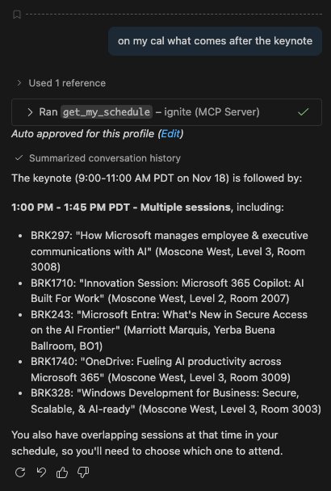
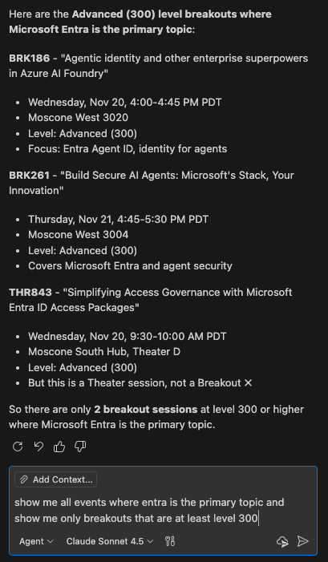
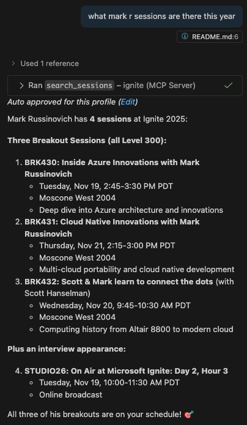

# Microsoft Ignite MCP Server

A Model Context Protocol (MCP) server providing access to Microsoft Ignite 2025 conference data—1,033 sessions, 1,579 speakers, plus your personal schedule and favorites.

## Examples: 
<div align="center">
  
  
  
</div>

## Features
- **7 MCP Tools**: Search sessions/speakers, get schedules, view favorites, and fetch complete conference data
- **Smart Caching**: Auto-refresh every 15 mins (sessions) and 60 mins (speakers) for fast, reliable access
- **Personal Data**: Full access to your authenticated Ignite schedule and favorites
- **Production Ready**: Tested with Claude Desktop and VS Code

## Quick Start

### 1. Install Dependencies
```bash
npm install
npm run build
```

### 2. Get Your Bearer Token

**Method 1: From Cookie (Recommended)**
1. Sign in at https://ignite.microsoft.com
2. Open DevTools (F12) → **Application** tab → **Cookies** → `ignite.microsoft.com`
3. Find the cookie named `ignite2025.prod.token`
4. Copy the cookie value and prefix it with `Bearer ` (e.g., `Bearer eyJhbGc...`)

**Method 2: Console Script**
Run this in the browser console on ignite.microsoft.com:
```javascript
(function () {
  const cookies = Object.fromEntries(
    document.cookie.split(";").map(c => {
      const [k, ...v] = c.split("=");
      return [k.trim(), decodeURIComponent(v.join("="))];
    })
  );

  const rawToken = cookies["ignite2025.prod.token"];
  if (!rawToken) {
    console.warn("ignite2025.prod.token cookie not found");
    return null;
  }

  const bearer = `Bearer ${rawToken}`;
  console.log("Bearer token:", bearer);
  return bearer;
})();
```

Note: This will only allow the MCP server to function for 1 hour at a time, anyone who knows a good way to enhance this like figuring out if there is a refresh token is welcome to contribute to the library.

### 3. Configure Token (optional)

Create a `.env` file:
```bash
IGNITE_BEARER_TOKEN=your_token_here
```

Note: You can also just put this into the mcp env config

⚠️ **Never commit your token to version control!**

## Configuration

### Claude Desktop

**macOS**: `~/Library/Application Support/Claude/claude_desktop_config.json`  
**Windows**: `%APPDATA%\Claude\claude_desktop_config.json`

```json
{
  "mcpServers": {
    "ignite": {
      "command": "node",
      "args": ["/absolute/path/to/mcp-ignite-server/build/index.js"],
      "env": {
        "IGNITE_BEARER_TOKEN": "your_token_here"
      }
    }
  }
}
```

### VS Code (Copilot)

Create or edit `.vscode/settings.json` in your workspace:

```json
{
  "github.copilot.chat.codeGeneration.instructions": [
    {
      "text": "Use MCP tools when available"
    }
  ],
  "github.copilot.chat.mcp.enabled": true,
  "github.copilot.chat.mcp.servers": {
    "ignite": {
      "command": "node",
      "args": ["/absolute/path/to/mcp-ignite-server/build/index.js"],
      "env": {
        "IGNITE_BEARER_TOKEN": "your_token_here"
      }
    }
  }
}
```

Restart VS Code after adding the configuration.

## MCP Tools Reference

| Tool | Description | Key Parameters |
|------|-------------|----------------|
| **get_all_sessions** | Fetch all 1,033 sessions (cached) | `refresh?: boolean` |
| **get_session_details** | Get specific session info | `sessionId: string` |
| **search_sessions** | Find sessions by keyword | `query: string`, `filterScheduled?`, `filterFavorites?` |
| **get_my_schedule** | Your personal schedule | — |
| **get_favorites** | Your favorited sessions/labs | — |
| **get_all_speakers** | Fetch all 1,579 speakers (cached) | `refresh?: boolean` |
| **search_speakers** | Find speakers by keyword | `query: string` |

**Examples:**
- "Show me all AI sessions in my schedule"
- "Find speakers from Microsoft working on Azure"
- "Get details for session BRK123"

## Caching & Data

Cache files stored in `data/`:
- **sessions-cache.json** (~8MB, refreshes every 15 min)
- **speakers-cache.json** (~2MB, refreshes every 60 min)

Benefits: instant responses, offline capability, reduced API load.

## API Details

Uses official Microsoft Ignite API (`https://api-v2.ignite.microsoft.com`):
- `/api/session/all/en-US` - All sessions
- `/api/schedule/sessions/en-US` - Your schedule  
- `/api/speaker/all/en-US` - All speakers
- `/api/favorite/*` - Your favorites

See `API_RESEARCH.md` for complete documentation.

## Troubleshooting

| Issue | Solution |
|-------|----------|
| "IGNITE_BEARER_TOKEN is not set" | Create `.env` file with your token |
| "API request failed: 401" | Token expired—get a fresh one |
| "No cached sessions available" | Run `get_all_sessions` first |

## Development

```bash
npm run build    # Compile TypeScript
npm run dev      # Watch mode
```

## License

MIT

## Security & Privacy

- Keep your bearer token secure—never commit or share it
- Tokens expire periodically; refresh as needed
- Server is read-only; it won't modify your data

## Disclaimer

Unofficial tool, not affiliated with Microsoft. Use responsibly and respect Microsoft's terms of service.
